---

> **Note:** This is a personal fork built from source for my own daily use. I prefer having all features available without the subscription overhead — so this build reflects that. See the original project at [alt-tab.app](https://alt-tab.app/) to support the upstream author.
